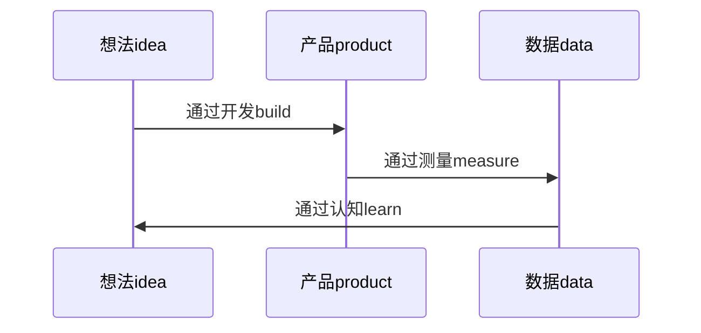

这是一个循环的过程，或者是一个螺旋形的向上的过程。人们在不断的用这个过程提升自己的认知，并获取各种反馈。

这个过程就是：

精益创业提出的一个非常重要的概念，最小可行产品。minimum viable product，简单说就是用最少的钱，做更多的事。

当别人要求去做一件事的时候，一般我们只要做自己弄清楚为什么要做这件事的时候再动手去做，否则就尽量的弄清楚，要不然期望不匹配，做出来的东西可能只是在耗费时间，并不能产生价值。在这个时候，有效的沟通也是非常必要的，简短扼要，有重点的沟通，可以实现信息的共享，并拓宽思路。当然是在同等的能力或者更高的能力的范围内的，和一个较低技能和水平的人进行沟通的结果可能带来混乱。

在进行渗透测试的时候，最重要的步骤就是信息收集，在一个技术能力相同的层级上，哪个人收集的信息越多，他获得突破口的可能性越大。

在解决问题和提升自己的过程中，也是如此。要从本身岗位的获取到的信息的上面的几层进行思考，越是获得的信息越多，思考的维度越高，对于做事情来说更有效率，带来的价值更大。

很多人可以完成自己本职工作的事情，但是这样规规矩矩的，很难有什么大的进步。当了解到了更多的上下文后，信息的带宽增加了，信息量也增加了，也就更容易让自己做到最好的判断和选择。  

大部分的人做事情都是缺乏完整的过程的。他们领到一个任务的时候，考虑到的是要尽快的干完。但是这个任务的本身到底是要干什么，为什么服务没有搞清楚。而且很多人的目标就是做完而已，没有什么做好，承上启下的这样的认知。这也是大部分的人很难获得提升的原因。认知的维度较低，就比较难看到全局，而看不到全局，就很难做出优化的方案出来。所提到的人人都是螺丝钉的这样的情况，到最后难以实现个人的价值，主要还是难以提升自己的认知。

**下面是一些行业的最佳实践**：

1. DoD（definite of done），做好完成的定义，减少团队内部的理解不一致
2. 要有用户故事，细化出有价值的需求
3. 持续集成，通过尽早集成，减少改动量，降低合并难度
4. 迭代0，在启动项目前，做好必要的基础准备

**一些必要的思考方式**：

1. 现在头脑中进行创造，然后再付诸实践
2. 获取信息，获取其来自特定方向的信息的上下文，才能更好的了解最终想要做什么
3. 要边做边推演，逐渐修正最合适和高效的路径，达到期望的结果
4. 要用可度量的数字来定义期望和问题
5. 应该做到“以终为始”，这样做事比较踏实

